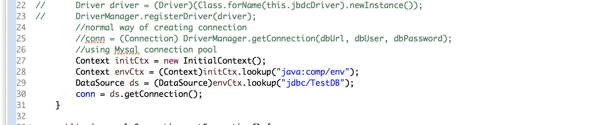
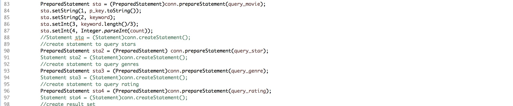
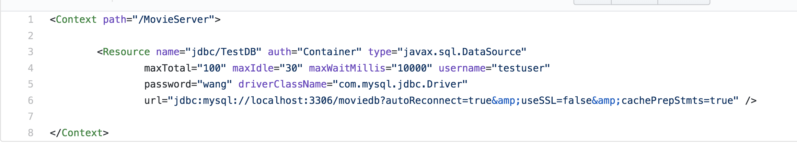
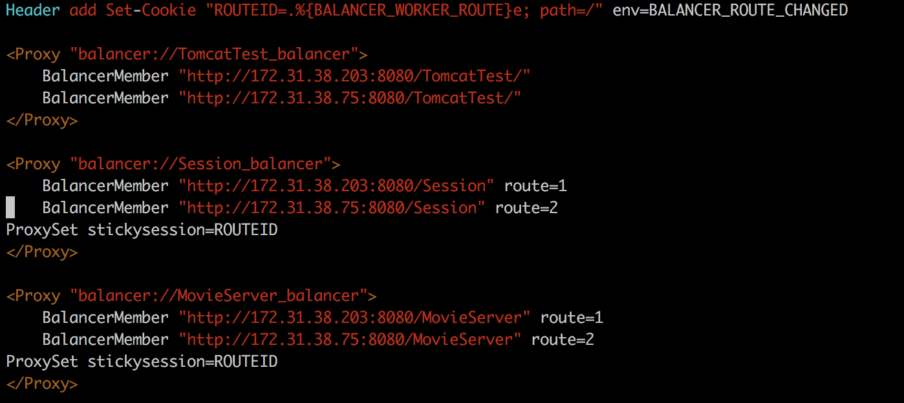

# Task 1

- How did you use connection pooling?

    We develop a Database singleton class to provide interfaces for getting database connection for each query.
    For the interfaces, we use database connection pooling to provide the connection, and release the connection after 
    each query.

	- File name, line numbers as in Github
	
    | File name | Line number |
    |---|---|
    | /MovieServer/DBpackage/DBconn.java | 27 - 30 |

	- Snapshots
	
	

- How did you use Prepared Statements?

    We replace Statement instances with Prepared Statement instances. For each query, we create prepared statement and put 
    different parameters in each iterations.

- File name, line numbers as in Github

    | File name | Line number |
    |---|---|
    | /MovieServer/Servlet/NormalSearch.java | 92 - 98 |

- Snapshots

    

# Task 2

- Address of AWS and Google instances

| Name | IP |
|---|---|
| Google Instance | 35.227.87.16 |
| AWS Apache Load Balancer | 18.222.3.139 |
| AWS Master Instance | 18.216.20.215 |
| AWS Slave Instance | 18.221.82.87 |

- Have you verified that they are accessible? Does Fablix site get opened both on Google’s 80 port and AWS’ 8080 port?

Yes, they are all accessible. Both port works normally.

- How connection pooling works with two backend SQL?

Many reserved connections are created at the first, so we don't need to create jdbc connection every time request comes.  We set the jdbc info in the context.xml.

- File name, line numbers as in Github

    | File name | Line number |
    |---|---|
    | /MovieServer/webcontent/META-INF |1-8|

- Snapshots

    

- How read/write requests were routed?

    The Apache Load Balancer will route the request to the master instance and slave instance randonly. Particularly, 
    read/write requests will be routed to the MySQL of master instance, and the read reuqests will be routed to the MySQL 
    of the slave or master instances.

- File name, line numbers as in Github

The file is located in the load balancer server:/etc/apache2/sites-enabled/000-default.conf 
line: 1-18

- Snapshots

    

# Task 3

- Have you uploaded the log file to Github? Where is it located?

    Yes. [Log directory](https://github.com/UCI-Chenli-teaching/cs122b-winter18-team-26/tree/master/Project5/ResultPage/timeLog)

- Have you uploaded the HTML file to Github? Where is it located?

    Yes. [jmeter_report.html](https://github.com/UCI-Chenli-teaching/cs122b-winter18-team-26/blob/master/Project5/ResultPage/jmeter_report.html)

- Have you uploaded the script to Github? Where is it located?

    Yes. [parse.js](https://github.com/UCI-Chenli-teaching/cs122b-winter18-team-26/blob/master/Project5/MovieServer/src/parse.js)

- Have you uploaded the WAR file and README to Github? Where is it located?

    Yes. [War file](https://github.com/UCI-Chenli-teaching/cs122b-winter18-team-26/tree/master/Project5/war)
